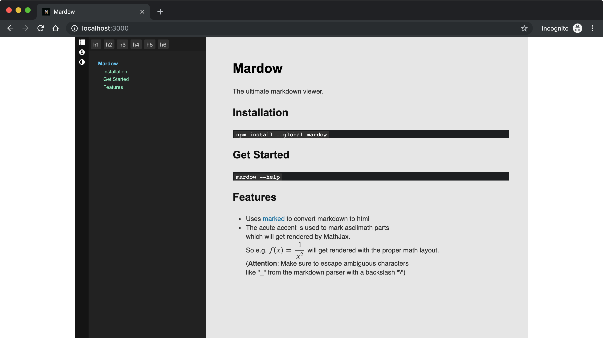

# Mardow

The ultimate markdown viewer.




## Installation

```sh
npm install --global mardow
```


## Get Started

```sh
mardow serve README.md
```

For more information run:

```sh
mardow --help
```


## Features

- Uses [Marked] to convert Markdown to HTML
- The acute accent is used to mark [AsciiMath] parts
  which will get rendered by [MathJax].
  So e.g. ´f(x) = 1/x^2´ will get rendered with the proper math layout.
  (**Attention**: Make sure to escape ambiguous characters
  like "\_" from the markdown parser with a backslash "\\")

[AsciiMath]: http://asciimath.org
[Marked]: https://github.com/markedjs/marked
[MathJax]: https://www.mathjax.org


## Features

- Highlighting even works correctly when there are several sections
    with the same name
